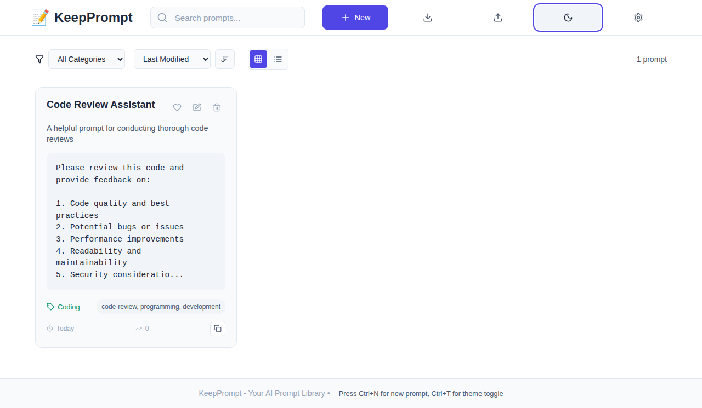

# KeepPrompt - AI Prompt Management Application

KeepPrompt is a modern, responsive React application designed to help you store, organize, and manage your AI prompts effectively. Built with a focus on usability and productivity, KeepPrompt provides a comprehensive solution for prompt library management.



## Features

### 🎯 Core Features

- **Prompt Management**: Create, edit, delete, and organize your AI prompts
- **Smart Search & Filtering**: Find prompts quickly using text search and category filters
- **Categories & Tags**: Organize prompts with custom categories and tagging system
- **Usage Tracking**: Monitor which prompts you use most frequently
- **Favorites System**: Mark important prompts for quick access

### 🎨 User Interface

- **Modern Design**: Clean, intuitive interface with professional styling
- **Dark/Light Theme**: Toggle between themes for comfortable viewing
- **Responsive Layout**: Works perfectly on desktop, tablet, and mobile devices
- **Copy-to-Clipboard**: One-click copying of prompt content
- **Grid/List Views**: Switch between card-based grid and compact list views

### 💾 Data Management

- **Local Storage**: All data stored locally in your browser for privacy
- **Import/Export**: Backup and restore your prompts with JSON export/import
- **Data Validation**: Comprehensive validation to ensure data integrity
- **Error Handling**: Graceful error handling with user-friendly messages

### ⚡ Productivity Features

- **Keyboard Shortcuts**: Power user shortcuts for quick navigation
- **Template System**: Quick-start templates for common prompt patterns
- **Sorting Options**: Sort by date, usage, title, or other criteria
- **Bulk Operations**: Efficient management of multiple prompts

### 🔧 Technical Features

- **React 19**: Built with the latest React for optimal performance
- **Modern CSS**: CSS custom properties with comprehensive theme support
- **Accessible**: WCAG-compliant design with keyboard navigation
- **PWA Ready**: Progressive Web App capabilities for offline use
- **Fast Performance**: Optimized bundle size and loading times

## Quick Start

### Prerequisites

- Node.js (version 14 or higher)
- npm or yarn package manager

### Installation

1. **Clone the repository:**
   ```bash
   git clone https://github.com/mrleonova/keepprompt.git
   cd keepprompt
   ```

2. **Install dependencies:**
   ```bash
   npm install
   ```

3. **Start the development server:**
   ```bash
   npm start
   ```

4. **Open your browser and navigate to:**
   ```
   http://localhost:3000
   ```

### Building for Production

```bash
npm run build
```

This creates a `build` folder with optimized production files ready for deployment.

### Running Tests

```bash
npm test
```

## Usage Guide

### Creating Your First Prompt

1. Click the **"New"** button in the header
2. Fill in the prompt details:
   - **Title**: A descriptive name for your prompt
   - **Description**: Brief explanation of what the prompt does
   - **Content**: The actual prompt text
   - **Category**: Choose from predefined categories or create custom ones
   - **Tags**: Add relevant tags for easier searching
3. Click **"Save Prompt"**

### Managing Prompts

- **Edit**: Click the edit icon on any prompt card
- **Delete**: Click the delete icon (with confirmation)
- **Favorite**: Click the heart icon to add/remove from favorites
- **Copy**: Click the copy button or click anywhere on the prompt card
- **Usage Tracking**: Usage count automatically increments when you copy prompts

### Searching and Filtering

- **Text Search**: Use the search bar to find prompts by title, description, content, or tags
- **Category Filter**: Use the dropdown to filter by specific categories
- **Sorting**: Sort prompts by date created, last modified, usage count, or alphabetically
- **View Modes**: Switch between grid and list views for your preference

### Using Keyboard Shortcuts

- `Ctrl+N` - Create new prompt
- `Ctrl+T` - Toggle dark/light theme
- `Ctrl+F` - Focus search input
- `Ctrl+E` - Export data
- `Escape` - Close modal/form

### Data Management

#### Export Your Data
1. Click the **Download** icon in the header
2. Your data will be downloaded as a JSON file
3. Save this file as a backup

#### Import Data
1. Click the **Upload** icon in the header
2. Select your previously exported JSON file
3. Your prompts will be restored

## Project Structure

```
src/
├── components/          # React components
│   ├── Header.js       # Main navigation header
│   ├── PromptCard.js   # Individual prompt display
│   ├── PromptForm.js   # Create/edit prompt form
│   └── PromptList.js   # List of prompts with controls
├── hooks/              # Custom React hooks
│   ├── usePrompts.js   # Prompt management logic
│   ├── useCategories.js # Category management
│   ├── useSettings.js  # App settings
│   ├── useSearch.js    # Search and filtering
│   └── useKeyboardShortcuts.js # Keyboard shortcuts
├── utils/              # Utility functions
│   ├── storage.js      # Local storage operations
│   └── helpers.js      # Helper functions
├── App.js              # Main application component
├── App.css             # Application-specific styles
└── index.css           # Global styles and CSS variables
```

## Architecture

### Data Flow
- **Local State**: React hooks manage component-level state
- **Custom Hooks**: Encapsulate business logic for reusability
- **Local Storage**: Persist data between sessions
- **Event Handling**: Unidirectional data flow with callback props

### Styling Approach
- **CSS Custom Properties**: Theme-aware color system
- **Component-scoped CSS**: Each component has its own stylesheet
- **Responsive Design**: Mobile-first approach with breakpoints
- **Accessibility**: Focus management and semantic markup

### Performance Optimizations
- **Code Splitting**: React.lazy for dynamic imports
- **Memoization**: useCallback and useMemo for expensive operations
- **Debounced Search**: Prevents excessive filtering operations
- **Optimized Renders**: Minimal re-renders through proper state management

## Customization

### Adding New Categories

Categories are defined in `src/utils/storage.js`. Default categories include:
- General
- Coding
- Writing
- Analysis
- Creative

You can add new categories through the application interface or modify the defaults in the storage file.

### Theme Customization

Themes are controlled through CSS custom properties in `src/index.css`. You can:
- Modify existing theme colors
- Add new theme variants
- Customize spacing and typography
- Adjust component-specific styling

### Adding New Templates

Prompt templates are defined in `src/utils/helpers.js` in the `generateTemplate` function. You can add new templates by:
1. Adding a new template object
2. Including it in the template selection UI
3. Testing the template generation

## Deployment

### Firebase Hosting (Configured)

The project is already configured for Firebase hosting:

```bash
npm run build
firebase deploy
```

### Other Deployment Options

- **Netlify**: Drag and drop the `build` folder
- **Vercel**: Connect your GitHub repository
- **GitHub Pages**: Use `gh-pages` package
- **Static File Server**: Serve the `build` folder contents

## Browser Compatibility

- **Modern Browsers**: Chrome 70+, Firefox 65+, Safari 12+, Edge 79+
- **Features Used**: 
  - CSS Custom Properties
  - ES6+ JavaScript features
  - Local Storage API
  - Clipboard API

## Contributing

1. Fork the repository
2. Create a feature branch (`git checkout -b feature/amazing-feature`)
3. Commit your changes (`git commit -m 'Add some amazing feature'`)
4. Push to the branch (`git push origin feature/amazing-feature`)
5. Open a Pull Request

### Development Guidelines

- Follow existing code style and patterns
- Write tests for new functionality
- Update documentation for new features
- Ensure responsive design compatibility
- Test across different browsers

## License

This project is licensed under the MIT License - see the [LICENSE](LICENSE) file for details.

## Support

If you encounter any issues or have questions:

1. Check the [Issues](https://github.com/mrleonova/keepprompt/issues) page
2. Create a new issue with detailed information
3. Include browser information and steps to reproduce

## Acknowledgments

- Built with [React](https://reactjs.org/)
- Icons by [Lucide React](https://lucide.dev/)
- Hosted on [Firebase](https://firebase.google.com/)
- Inspiration from modern productivity applications

---

**Happy prompting! 🚀**

*KeepPrompt - Keep your AI prompts organized and accessible.*
